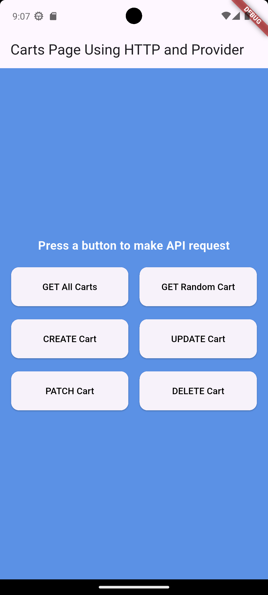
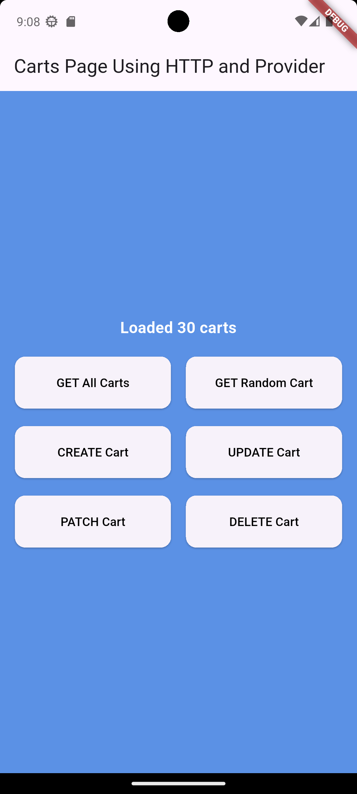
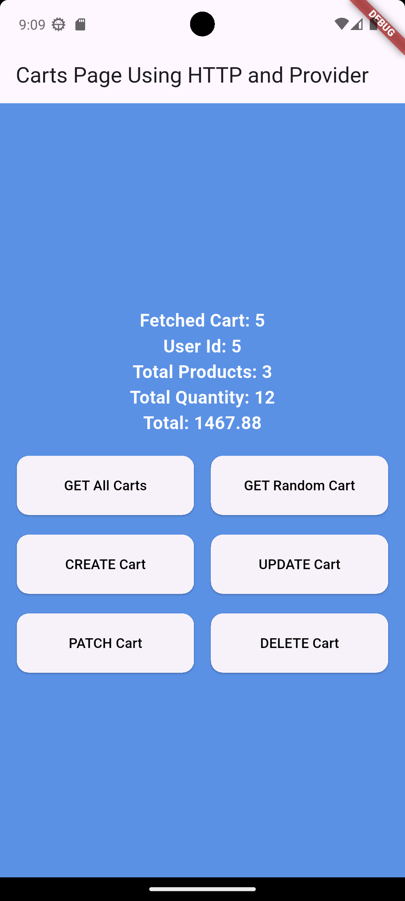
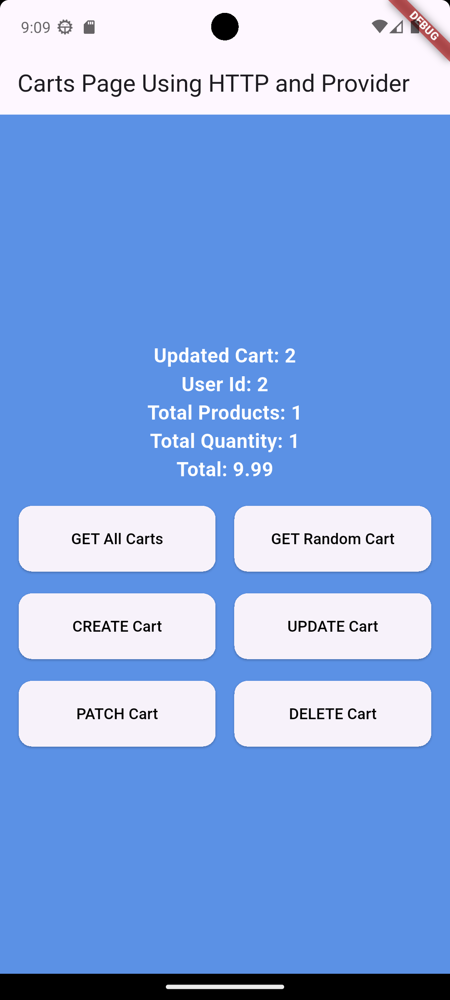

# API Using HTTP and Provider

A Flutter application that performs CRUD (Create, Read, Update, Delete) operations using the DummyJSON API with the http package and Provider state management.

---

## Features

- Fetch all carts
- Fetch random cart
- Create cart
- Update cart
- Patch cart
- Delete cart
- Loading states
- Error handling
- Provider state management

---

## API Used

DummyJSON API

https://dummyjson.com/carts

---

## Screenshots

### Home Screen

### Fetch All

### Fetch Single

### Create Cart

### Update Cart

### Patch Cart

### Delete Cart

---

## Name, ID and Section

- Natnael Habteselassie Demissie
- UGR/5666/16
- Section 2
